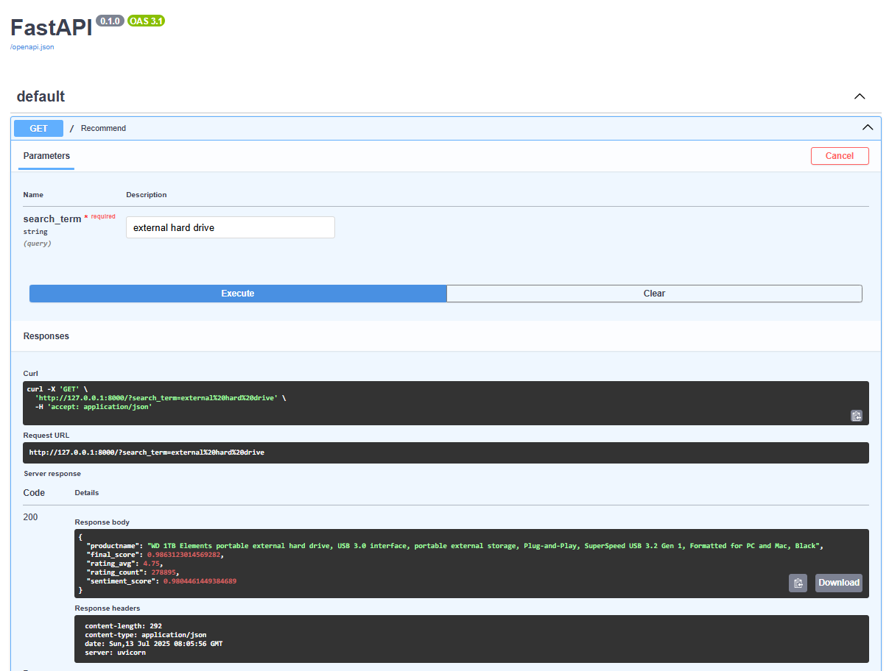

# Amazon Product Recommender System

## Overview

Welcome to the Amazon Product Recommender System! This project provides a robust framework for building and deploying a product recommendation engine. Designed to offer personalized or popular product suggestions, this system integrates data scraping capabilities, a sophisticated recommendation model, and a user-friendly web API for seamless interaction. It's built to help you understand and implement core concepts of modern recommender systems.

## Key Features

This system is engineered with distinct components to handle the full recommendation pipeline:

* **Amazon Product Data Scraper:** The `amazon_scraper.py` script is at the heart of data collection, enabling you to efficiently gather product information, including details, reviews, and ratings, directly from Amazon.

* **Intelligent Recommendation Model:** Driven by `Model.py` and `prod_recommender.py`, the system leverages machine learning to generate insightful product recommendations. Whether you're exploring collaborative filtering, content-based methods, or a hybrid approach, this core component is designed for flexibility.

* **Recommendation API:** The `api.py` script serves as the main entry point, providing a clean and accessible API. This allows other applications, frontends, or services to easily request and receive product suggestions.

* **Efficient Data Management:** With various `.json` and `.csv` files (e.g., `Fender Squier.json`, `laptop.json`, `nmve.csv`), the project demonstrates effective processing and storage of diverse product-related datasets.

## Getting Started

Follow these steps to set up and run the Amazon Product Recommender System on your local machine.

### Installation

1.  **Clone the repository:**

    ```bash
    git clone [https://github.com/am-a-s/Amazon-Recommender.git](https://github.com/am-a-s/Amazon-Recommender.git)
    cd Amazon-Recommender
    ```

2.  **Create and activate a virtual environment:**
    It's highly recommended to use a virtual environment to manage project dependencies.

    ```bash
    python -m venv .venv
    # On Windows
    .venv\Scripts\activate
    # On macOS/Linux
    source .venv/bin/activate
    ```

3.  **Install dependencies:**
    While a `requirements.txt` file isn't explicitly provided, here are the common Python libraries typically used in such a project. You can try installing these, and then check for any missing modules when you run the scripts.

    ```bash
    pip install requests beautifulsoup4 pandas numpy scikit-learn flask uvicorn
    ```

    *Note: The exact dependencies and their versions are best confirmed by inspecting the `import` statements within `api.py`, `amazon_scraper.py`, `Model.py`, and `prod_recommender.py`.*

### Usage

#### 1. Data Scraping (Optional, if needed for see the data collection)

If you need to collect new product data, you can run the scraping script:

```bash
python amazon_scraper.py
```
### 2. Running the Recommendation API

The `api.py` script is designed to serve your recommendation engine. Depending on its implementation (e.g., Flask or FastAPI), you'll run it as follows:

* **For a Flask application (common for simple APIs):**

    ```bash
    python api.py
    ```

* **For a FastAPI application (often used for modern, high-performance APIs):**

    ```bash
    uvicorn api:app --reload --host 0.0.0.0 --port 8000
    ```
    *(Adjust `api:app` if your FastAPI application object is named differently within `api.py`.)*

Once the API is running, you can interact with its endpoints (e.g., `/recommend`, `/predict`) using tools like Postman, `curl`, or by integrating it into your own web applications. Refer to the `api.py` source code for detailed endpoint definitions, expected request payloads, and response formats.

## Contributing

We welcome contributions to enhance this Amazon Product Recommender System! If you're interested in improving the project, please follow these guidelines:

1.  **Fork** the repository on GitHub.
2.  **Create a new branch** for your feature or bug fix:
    `git checkout -b feature/your-awesome-feature`
3.  **Implement your changes.**
4.  **Commit your work** with a clear and concise message:
    `git commit -m "Feat: Add a new recommendation algorithm"`
5.  **Push** your changes to your forked repository:
    `git push origin feature/your-awesome-feature`
6.  **Open a Pull Request** to the `main` branch of the original repository.

## License

This project is open-source and available under the **MIT License**. This means you are free to use, modify, and distribute the code for both commercial and non-commercial purposes, provided you include the original copyright and license notice in any copy of the software.

For more details, please see the `LICENSE` file in the repository (if present, or create one with the MIT license text).

## Contact

If you have any questions, suggestions, or need assistance, please feel free to reach out to the repository owner directly via GitHub: [am-a-s](https://github.com/am-a-s).
